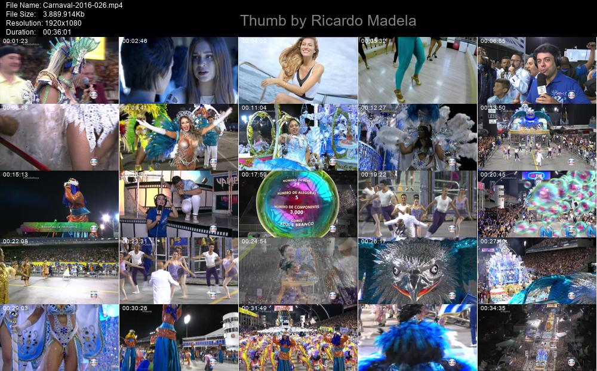

# Video Thumbnails by Ricardo Madela

## Installation

You will need to install some simple dependencies such as:

+ PIL (pip install pillow)
+ glob (pip install glob2)
+ random (pip install random)
+ moviepy (pip install moviepy)

The presence of the ffmpeg program and its inclusion in the 'path' will be necessary. I prefer to copy the ffmpeg executable to the windows folder so that it becomes accessible from any folder.

Congratulations! Enjoy~!

## Usage

When you run the program, it will create the thumbnail of each of the videos in the folder it is in, one by one. It accepts videos of any of the formats mov, mp4, mpg, mov, mpeg, flv, wmv, avi, mkv and rmvb.

If you liked it and want to help me:
BTC address: 32MEWcLH2cLLHJyGUGHpByph18QiTJAzSG

## Instalação

Você precisará instalar algumas dependências simples, como PIL (pip install pillow), glob (pip install glob2), random (pip install random) and moviepy (pip install moviepy). Será necessária a presença do programa ffmpeg e sua inclusão no 'path'. Eu prefiro copiar o executável do ffmpeg para a pasta do windows, para que ele se torne acessível a partir de qualquer pasta.

## Uso

Ao executar o programa, ele criará o thumbnail de cada um dos vídeos que estiverem na pasta em que ele está, um a um. Ele aceita vídeos de qualquer um dos formatos mov, mp4, mpg, mov, mpeg, flv, wmv, avi, mkv e rmvb.

Se gostou e quiser me ajudar:
BTC address: 32MEWcLH2cLLHJyGUGHpByph18QiTJAzSG
